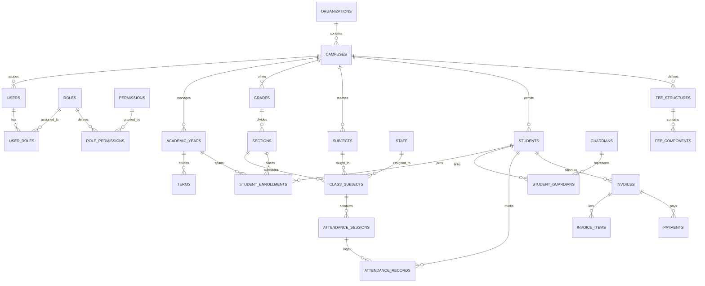

# SARBIX SCHOOL OPERATING SYSTEM — TARGET STATE ARCHITECTURE & PRODUCT SPECIFICATION

**Author:** Lead Product Architect, UX Strategist, Senior Full-Stack Engineer, Database Architect & Security Engineer  
**Date:** October 2026  
**Status:** PROPOSED & FULLY SPECIFIED (AWAITING CLIENT APPROVAL FOR PHASE 1 IMPLEMENTATION)  
**Governing Documents:**
- Sarbix School OS Proposal (October 2026)
- Agent Pack Specifications (`01_PRODUCT_TRUTH_AND_SCOPE.md` through `18_ONE_SHOT_ANTIGRAVITY_PROMPT.md`)

---

## 1. PRODUCT VISION, BRAND & EXPERIENCE PROMISE

### Working Title
**Sarbix School OS** — *The AI-Powered Digital Operating System for Modern Schools.*

### Core Value Proposition
> **"One school. One operating system."**  
> Move from disconnected paper registers, fragmented spreadsheets, and chaotic WhatsApp groups to one secure digital ecosystem connecting management, teachers, students, parents, and transport.

### Product Principles
1. **Zero Admin Waste:** Enter information once; project it everywhere it is legitimately required.
2. **Context First, Action Fast:** Every screen immediately answers:
   - *What is happening?*
   - *What needs attention right now?*
   - *What is the next useful action?*
3. **Trust & Safety by Design:** Strict role boundaries, auditable mutations, verifiable family links, and human review for high-impact AI outputs.
4. **Professional Dignity with Modern Character:** A sleek command center aesthetic with an editorial, contemporary finish—never cartoonish, never generic Bootstrap blue.

---

## 2. CANONICAL ROLE & PERSONA ARCHITECTURE

Users log in through a single unified authentication screen with **zero role selection dropdowns**. The server authenticates credentials and resolves the user's role assignments and campus permissions.

```
                  ┌──────────────────────────────┐
                  │   Unified User Identity      │
                  │   (Email / Phone + Password) │
                  └──────────────┬───────────────┘
                                 │
                     Server Authentication
                                 │
                  ┌──────────────▼───────────────┐
                  │    Role & Campus Resolver    │
                  └──────────────┬───────────────┘
                                 │
           ┌─────────────────────┼─────────────────────┐
           ▼                     ▼                     ▼
┌─────────────────────┐┌───────────────────┐┌─────────────────────┐
│ Single Role Account ││ Multi-Role Account││ Account Deactivated │
│ Auto-route to shell ││ Select Workspace  ││ Access Denied       │
└─────────────────────┘└───────────────────┘└─────────────────────┘
```

### The 8 Canonical Roles & Dashboards

1. **Principal / Management:**
   - **Command Center:** Whole-school health, enrollment numbers, attendance trends, fee collection status, academic comparisons across sections, operational alerts, and AI management intelligence.
2. **Admin Office:**
   - **Operations Workspace:** Admissions pipeline, student records, document verification, staff onboarding/exit, official notices, visitor gate logs.
3. **Accounts / Finance:**
   - **Finance Center:** Fee structures, student billing, automated invoice generation, payment reconciliation, receipts, outstanding balances, concessions, refund tracking.
4. **Teacher:**
   - **Classroom Hub:** Daily schedule, 10-second rapid attendance marking, homework/assignment publishing, marks entry, class messaging, AI teaching copilot (lesson outlines, quizzes).
5. **Parent / Guardian:**
   - **Family Portal:** Multi-child switcher, live attendance, homework, report cards, fee payment with digital receipts, bus tracking/ETA, PTM appointments, school announcements.
6. **Student:**
   - **Learning Space:** Personal timetable, homework submission, exam results, learning resources, achievements, digital ID card, fee status.
7. **Transport Team / Driver:**
   - **Route Operations:** Assigned routes, stop sequences, student passenger rosters, boarding/drop check-ins, vehicle status, emergency escalation.
8. **IT / System Administrator:**
   - **System Governance:** User provisioning, role & permission assignments, audit logs, backup verification, integration management, security monitoring.

---

## 3. TARGET TECHNOLOGY STACK

```
┌─────────────────────────────────────────────────────────────┐
│                       USER INTERFACE                        │
│   Next.js 15+ App Router • React 18/19 • Tailwind CSS       │
│   Radix UI Primitives • TanStack Table • Recharts • Lucide  │
├─────────────────────────────────────────────────────────────┤
│                    APPLICATION SERVICES                     │
│   Auth.js / Secure Session Cookies • Zod Validation         │
│   Server Actions • Resource-Oriented Route Handlers         │
├─────────────────────────────────────────────────────────────┤
│                       DOMAIN LAYER                          │
│   Role & Permission Guard (`requirePermission`)             │
│   Workflow Engine • Audit Logger • AI Permission Scoper     │
├─────────────────────────────────────────────────────────────┤
│                      DATA ACCESS LAYER                      │
│   PostgreSQL / Supabase (Canonical Normalized Schema)       │
│   Row-Level Security • Storage Buckets • Realtime Channels  │
└─────────────────────────────────────────────────────────────┘
```

- **Frontend Framework:** Next.js 15+ App Router, TypeScript strict mode (`noImplicitAny`, strict null checks).
- **Styling & Design System:** Tailwind CSS with CSS variables tokenized for light and dark modes. Radix UI headless components for accessibility.
- **Data Grids & Visuals:** TanStack React Table v8 for responsive data density. Recharts for operational trendlines.
- **Form Architecture:** React Hook Form + Zod resolvers with server-side schema re-validation.
- **Database Engine:** PostgreSQL 16+ via Supabase. Single source of truth. All MongoDB and Mongoose dependencies permanently decommissioned.
- **Authentication & Session:** Cryptographically signed, HTTP-only secure session cookies. Zero storage of auth flags or roles in browser `localStorage`.
- **Quality Gates:** 100% build passing with zero `ignoreBuildErrors` or `ignoreDuringBuilds` suppression flags.

---

## 4. CANONICAL DATABASE SCHEMA (POSTGRESQL / SUPABASE)

The normalized database architecture eliminates all data duplication and ensures strict relational integrity across 15 core domains:



### Key Schema Entities & Invariants
1. **Tenancy & Scoping:** Every institutional record (`students`, `staff`, `fee_structures`, `academic_years`) has a direct foreign key to `campus_id`.
2. **Student Identity vs Enrollment:**
   - `students`: Immutable identity (legal name, DOB, gender, blood group, admission number).
   - `student_enrollments`: Time-bounded placement (student, academic year, section, roll number, status).
3. **Parent / Guardian Linkage:**
   - Dedicated `guardians` table linked through `student_guardians` with explicit booleans (`is_primary`, `pickup_authorized`).
   - Parents can only query children linked via this junction table.
4. **Attendance Normalization:**
   - `attendance_sessions`: Represents the roll-call event (class_subject_id, date, recorded_by, session_type).
   - `attendance_records`: Individual student marks (Present, Absent, Late, Excused) with optional correction audit notes.
5. **Finance Normalization:**
   - `fee_structures` -> `fee_components` (Tuition, Lab, Transport, Library).
   - `invoices` -> `invoice_items` -> `payments` -> `receipts`.
   - Invoices maintain strict invariant: `total_amount = sum(invoice_items.amount)`.
6. **Transport Operations:**
   - `routes` -> `route_stops` -> `student_transport_assignments`.
   - `trips` -> `trip_events` (real-time telemetry, stop arrival, student boarding check-in).
7. **Audit Trail:**
   - `audit_logs`: Immutable, append-only records containing `actor_user_id`, `action`, `entity_type`, `entity_id`, `before_state (JSONB)`, `after_state (JSONB)`, `ip_address`, `timestamp`.

---

## 5. CANONICAL API & AUTHORIZATION MODEL

### Standard API Response Envelope
Every API route handler must return a predictable JSON envelope:

```typescript
// Successful response
{
  "data": T,
  "meta": {
    "page"?: number,
    "total"?: number,
    "timestamp": string
  },
  "error": null
}

// Error response
{
  "data": null,
  "meta": {
    "timestamp": string
  },
  "error": {
    "code": "UNAUTHORIZED" | "FORBIDDEN" | "NOT_FOUND" | "VALIDATION_ERROR" | "INTERNAL_ERROR",
    "message": string,
    "details"?: Record<string, string[]>
  }
}
```

### Centralized Server-Side Permission Guard
```typescript
// src/lib/auth/guard.ts
export async function requirePermission(
  req: Request | NextRequest, 
  permissionKey: string, 
  requiredCampusId?: string
): Promise<AuthenticatedSession> {
  const session = await getSession(req);
  if (!session) {
    throw new ApiError(401, 'UNAUTHORIZED', 'Authentication required');
  }
  if (!session.user.isActive) {
    throw new ApiError(403, 'FORBIDDEN', 'User account deactivated');
  }
  
  const hasPermission = session.permissions.includes(permissionKey);
  if (!hasPermission) {
    throw new ApiError(403, 'FORBIDDEN', `Missing required permission: ${permissionKey}`);
  }
  
  if (requiredCampusId && session.user.role !== 'SUPER_ADMIN') {
    if (session.user.campusId !== requiredCampusId) {
      throw new ApiError(403, 'FORBIDDEN', 'Unauthorized campus access');
    }
  }
  
  return session;
}
```

### Parent Object-Level Security Invariant
```typescript
// When a parent accesses student data:
const linkedChild = await db.query(
  `SELECT 1 FROM student_guardians 
   WHERE guardian_id = $1 AND student_id = $2`,
  [session.guardianId, requestedStudentId]
);
if (!linkedChild.exists) {
  throw new ApiError(403, 'FORBIDDEN', 'Access to unlinked student record denied');
}
```

---

## 6. DESIGN SYSTEM: "SCHOOL OS COMMAND CENTER"

### Visual Philosophy
- **Aesthetic:** Editorial, calm, high-density institutional software with subtle Gen-Z touches.
- **Color Palette (70 / 20 / 10 Rule):**
  - **70% Neutral Canvas:** Soft warm off-white in light mode (`hsl(220 14% 97%)`); sleek dark charcoal in dark mode (`hsl(222 47% 11%)`).
  - **20% Structural Ink:** Deep navy-slate for navigation rails, command headers, and typography (`hsl(222 47% 11%)`).
  - **10% Expressive Accent:** Electric violet / vibrant cyan (`hsl(262 83% 58%)` / `hsl(199 89% 48%)`) reserved for active states, AI highlights, and primary CTAs.
  - **Semantic Status:** Emerald for success/paid, Amber for attention/due, Coral/Crimson for overdue/absent/critical.
- **Typography:**
  - Headings: Editorial Sans (Inter / Space Grotesk / Outfit) with balanced letter-spacing.
  - Data / Tables: Clean legible tabular numerals (`font-variant-numeric: tabular-nums`).
- **Core Layout Structure:**
  - **Desktop:** 260px collapsible sidebar rail, sticky command header with global search/command palette (`Ctrl+K`), 12-column responsive grid with 24px gutters.
  - **Tablet:** Auto-collapsing rail to icon bar; two-column adaptive grids.
  - **Mobile:** Mobile header with drawer navigation, bottom quick-action bar for high-frequency workflows (Attendance, Notices, Fees), responsive card fallbacks for wide tables.

---

## 7. AI COPILOT & AUTOMATION ENGINE

### Architectural Rule
**AI is a permission-scoped decision-support layer, not an autonomous agent.** The model never receives records that the requesting user cannot view directly.

```
┌─────────────────────────────────────────────────────────────┐
│ 1. User prompts: "Show students with <75% attendance"       │
└──────────────────────────────┬──────────────────────────────┘
                               │
┌──────────────────────────────▼──────────────────────────────┐
│ 2. Server authenticates user role & campus permissions      │
└──────────────────────────────┬──────────────────────────────┘
                               │
┌──────────────────────────────▼──────────────────────────────┐
│ 3. Authorized SQL Query retrieves only permitted rows       │
└──────────────────────────────┬──────────────────────────────┘
                               │
┌──────────────────────────────▼──────────────────────────────┐
│ 4. Scoped context passed to AI model                        │
└──────────────────────────────┬──────────────────────────────┘
                               │
┌──────────────────────────────▼──────────────────────────────┐
│ 5. AI produces summary + suggested action queue             │
└──────────────────────────────┬──────────────────────────────┘
                               │
┌──────────────────────────────▼──────────────────────────────┐
│ 6. Human Review Required before sending notices or alerts   │
└─────────────────────────────────────────────────────────────┘
```

### Core AI Capabilities
1. **Management Assistant:** Natural language query answering on operational metrics, cross-class performance trends, and attendance anomalies.
2. **Teacher Academic Assistant:** Drafting lesson plans, generating syllabus-aligned quizzes and worksheets, crafting parent update messages.
3. **Student Learning Explainer:** Topic summaries, practice questions, and study planning (strictly gated against exam leaks).
4. **Human-in-the-Loop Governance:** All AI-drafted parent communications, academic reports, and intervention flags require an authorized human click to publish. Every AI query and prompt is logged to `ai_requests` and `ai_reviews`.

---

## 8. HARDENED SECURITY BASELINE

Every vulnerability discovered during reconnaissance is permanently eliminated in the target state:

1. **Credentials:** 100% removal of hardcoded passwords and seed credentials. Password hashing strictly via bcrypt with salt rounds >= 12 or Argon2id.
2. **Secrets:** Zero fallback keys. If `AUTH_SECRET` or `DATABASE_URL` is undefined, the application immediately throws a startup fatal error.
3. **Data APIs:** Every endpoint enforces `requirePermission()`. No generic proxy endpoints like `/api/supabase-mock`.
4. **Data Leakage:** No `/api/data` dump. All query projections explicitly omit password hashes and internal metadata.
5. **Database RLS:** In Supabase/PostgreSQL, row-level security policies strictly check `auth.uid()` against user campus and role mappings.
6. **Input Validation:** All POST/PUT/PATCH endpoints parse incoming JSON through Zod schemas before hitting the database.
7. **Rate Limiting:** Auth and public application routes protected by sliding-window rate limiting.
